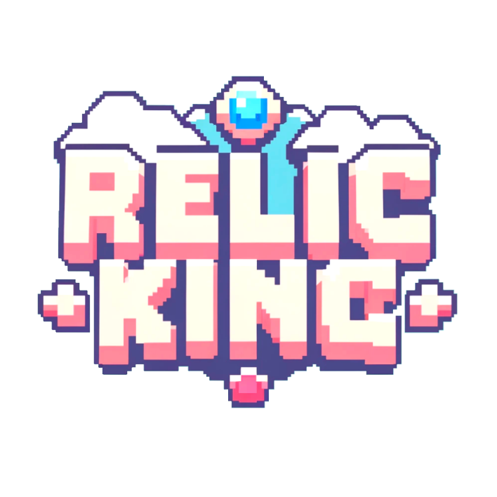
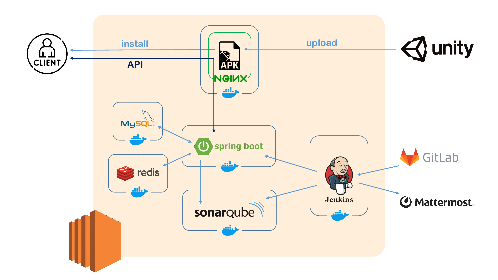
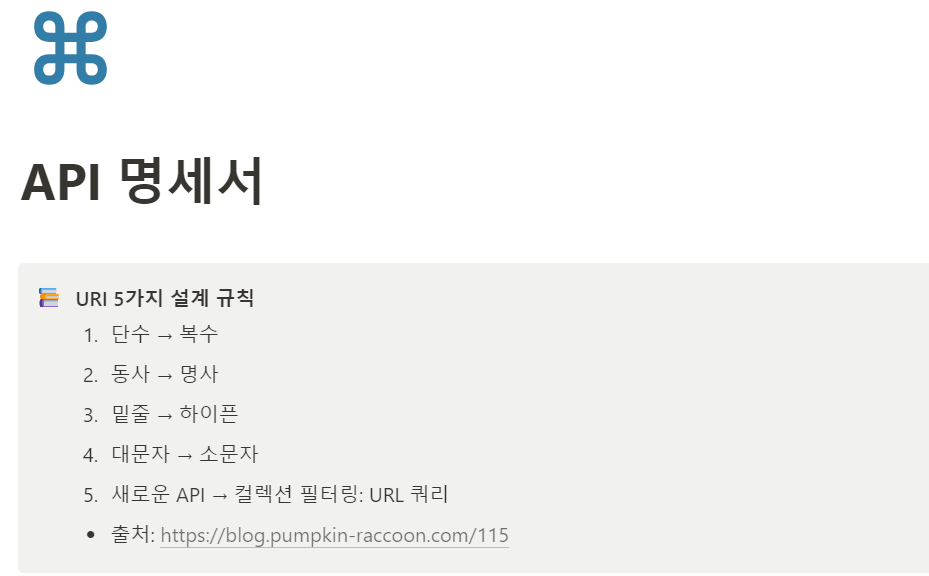

# 👑 RelicKing

<div align="center">
  <br />
  
  <br />
</div>

## 목차

- [서비스 개요](#서비스-개요)
- [팀원소개](#팀원소개)
- [기술스택](#기술스택)
- [시스템 아키텍처](#시스템-아키텍처)
- [기능소개](#기능소개)
- [프로젝트 산출물](#프로젝트-산출물)
- [컨벤션](#컨벤션)

## 서비스 개요

```
방치형 전략 로그라이크 학습 타이머 RelicKing
지금 바로 다운로드 !! 🔥🔥

📌 2024.04.08 ~ 2024.05.20 (6주)
```

## 팀원소개

<div align="middle">
<table>
    <tr>
        <td height="140px" align="center"> <a href="https://github.com/DarkBlackRice">
             <br><br> 🍖 전지환 <br>(Client) </a> <br></td>
        <td height="140px" align="center"> <a href="https://github.com/CHAFALL">
             <br><br> 🎮 전근렬 <br>(Client) </a> <br></td>
        <td height="140px" align="center"> <a href="https://github.com/seolyeonpark">
             <br><br> 🍻 박설연 <br>(Client) </a> <br></td>
        <td height="140px" align="center"> <a href="https://github.com/hyoseon1201">
             <br><br> 🍔 곽효선 <br>(Client) </a> <br></td>
        <td height="140px" align="center"> <a href="https://github.com/kim-hyunggyu">
             <br><br> 🥇 김형규 <br>(Client) </a> <br></td>
        <td height="140px" align="center"> <a href="https://github.com/jjjoina">
             <br><br> 🏀 조인화 <br>(Back) </a> <br></td>
        <td height="140px" align="center"> <a href="https://github.com/K-Dongyoung">
             <br><br> 🎧 김동영 <br>(Back) </a> <br></td>
    </tr>
</table>
</div>

## 기술스택

### 게임 클라이언트

<div align="middle">


**Language |** C# 9.0

**Framework |** Unity

**IDE |** Unity Hub 3.7.0, Unity Editor 2022.3.23f1, Rider 2024.1.1


<br>
<br>

</div>

### 게임 서버 (백엔드)

<div align="middle">


**Language |** Java 17

**Framework |** Spring Boot 3.2.5

**Data(RDBMS) |** Spring Data JPA

**Build Tool |** Gradle 8.7.0

**IDE |** 	Intellij 2023.3.2

</div>

<br>
<br>


### 인프라

<div align="middle">


**Server |** GitLab, Jenkins, Docker

</div>
<br>
<br>

## 시스템 아키텍처

<div align="middle">
  <br />
  
  <br />
</div>

## 기능소개

- 기능 소개 추가할 예정... 화면별로 녹화해두기.@!!


## 프로젝트 산출물

- API 명세서
<div align="middle">
  <br />
  
  <br />

  > https://www.notion.so/API-4bb236aef86748c98996c0af4759be59
</div>


- ERD

<div align="middle">
  <br />
  
  <br />
</div>

<br>
<br>

- 와이어프레임
<div align="middle">
  <br />
  
  <br />

> https://www.figma.com/design/eObPcWQnqiQnUCLzvlgdsK/D211-%3A-Agile-Online?node-id=886%3A523&t=FeyDexWx7kHtsljD-1type=design&node-id=143%3A533&mode=design&t=jmWbTaIamnQybbWO-1
</div>


<br>
<br>


- 포팅매뉴얼

<!-- > [포팅매뉴얼](./exec/distributed_file_system_setting.md) -->

## 컨벤션

### GIT

```
################
# type, body, footer는 각각 공백 줄로 한칸씩 띄워작성합니다.
# 1. Type
# [Skill] type: Subject (공백 작성 시 주의)
# Ex)[CT] feat: 회원정보 수정 기능 추가
# Ex)[BE] feat: 회원정보 수정 기능 추가

################
# 1-1. Subject Type
#   - feat: 새로운 기능 추가
#   - fix: 오류 수정
#   - docs: 문서(readme.md, json 파일 등) 수정, 라이브러리 설치
#   - style: 코드 포맷 변경, 세미콜론 누락 등 코드의 기능에 영향을 주지 않는 변경사항
#   - refactor: 코드 리팩토링
#   - test: 테스트 코드, 리팩토링 테스트 코드 추가
#   - chore: 빌드 업무 수정, 패키지 매니저 설정 등의 변경사항
#   - setting: 개발 환경 구축과 관련된 커밋
#   - api: 서버 API 통신 이슈
#   - deploy: 배포와 관련된 커밋
# 1-2. Subject
#   - 50글자를 넘지 않도록 작성
#   - 마침표 및 특수기호는 사용하지 않습니다.
#   - 제목은 완전한 서술형 문장이 아니라, 간결하고 요점적인 서술을 위해 개조식 구문을 사용
################(아래는 공백 유지 : Type과 Body의 구분)

# 2. Body
# body는 작업 내용이 복잡하거나 상세한 내용을 남겨야 하는 경우에만 작성
# Ex) 
# - 이미지 업로드 기능 추가
# - 회원 정보 수정 api 연동

################
# 2-1. Body 작성 규칙
#   - 본문은 72자 내로 작성
#   - 필요한 경우 여러줄로도 작성 가능
#   - 여러 줄의 메시지를 작성할 땐 "-"로 구분 
#   - 변경 내용보다 변경 이유를 작성해야 한다.(나중에 봤을 때 코드 작성 이유를 파악하기 위해)
################(아래는 공백 유지 : Body와 Footer의 구분)s

# 3. Footer
# 선택 사항으로 코드 작업과 관련된 이슈 번호 또는 참조 링크 등을 추가
# Ex) Fixes: #1 (옵션_여기선 이슈번호에 []를 치면 안됨, 반영할려면 merge 필요)

################
# 3-1. Footer(꼬리말) 작성 규칙
#   - 꼬리말은 optional이며 이슈 트래커 ID를 작성
#   - 꼬리말은 "유형: #이슈 번호" 형식으로 사용
#   - 여러 개의 이슈 번호를 적을 때는 쉼표(,)로 구분
# 3-2. 이슈 트래커 유형
#   - Fixes: 이슈 수정 중(아직 해결되지 않은 경우)

# 최종 메세지 예시
# [FE] Feat #1: 회원정보 수정 기능 추가 
# (공백 필수)
# - 이미지 업로드 기능 추가(옵션)
# - 회원 정보 수정 api 연동(옵션)
# (공백 필수)
# Fixes: #1(옵션_여기선 이슈번호에 []를 치면 안됨, 반영할려면 merge 필요)

## Branch

1. **main 브랜치**: 안정적인 버전의 코드가 저장되는 브랜치로, 프로덕션 준비가 완료된 코드만이 master에 병합됩니다. 일반적으로 배포 가능한 상태만을 유지합니다.
2. **develop 브랜치**: 개발을 위한 주요 브랜치로, 기능 개발 브랜치들이 병합되는 곳입니다. 개발의 최신 상태를 반영하며, 다음 릴리즈를 준비하는 코드가 모여 있습니다.
3. **feature 브랜치들**: 새로운 기능 개발이나 버그 수정을 위해 develop 브랜치로부터 분기된 브랜치입니다. 개발이 완료되면 다시 develop 브랜치로 병합됩니다.

```

### 예시

```
- master
  - be-develop
    - be/fix-bonus-gacha
  - fe-develop
    - ct/ranking-popup
```
