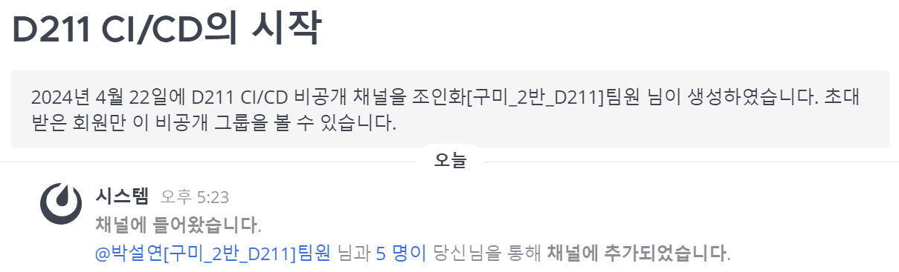

# 개발 환경

| JVM | Java 17 |
| --- | --- |
| WAS | Spring Boot 3.2.5 |
| Build Tool | Gradle 8.7 |
| IDE | Intellij 2023.3.2 |

# Infra

## 최종 코드

- `application.yaml`
    
    ```yaml
    server:
      port: 8081
      url: http://localhost:8081
      description: Local Server
    
    spring:
      datasource:
        url: jdbc:mysql://localhost:3306/relicking?serverTimezone=Asia/Seoul
        username: seveneleven
        password:
        driver-class-name: com.mysql.cj.jdbc.Driver
      jpa:
        hibernate:
          ddl-auto: update
        show-sql: true
        properties:
          hibernate:
            format_sql: true
            default_batch_fetch_size: 1000
      jwt:
        secret:
      mail:
        host: smtp.gmail.com
        port: 587
        username:
        password:
        properties:
          mail:
            smtp:
              auth: true
              starttls:
                enable: true
                required: true
              connectiontimeout: 5000  # 클라이언트가 SMTP 서버와의 연결을 설정하는데 대기해야 하는 시간
              timeout: 5000  # 클라이언트가 SMTP 서버로부터 응답을 대기해야 하는 시간. 서버에서 응답이 오지 않는 경우 대기 시간을 제한하기 위해 사용.
              writetimeout: 5000  # 클라이언트가 작업을 완료하는데 대기해야 하는 시간. 이메일을 SMTP 서버로 전송하는데 걸리는 시간을 제한하는데 사용.
        auth-code-expiration-millis: 600000  # 이메일 인증 코드 만료 시간 10분
      data:
        redis:
          port: 6379
          host: localhost
          password:
    
    logging:
      level:
        sql: info
    
    springdoc:
      api-docs:
        path: /api/docs
      default-consumes-media-type: application/json
      default-produces-media-type: application/json
      show-login-endpoint: true
      swagger-ui:
        path: /api/swagger-ui
        operations-sorter: alpha
        tags-sorter: alpha
        disable-swagger-default-url: true
        display-query-params-without-oauth2: true
        doc-expansion: none
      paths-to-match:
        - /**
    
    ```
    
- `docker-compose.yml`
    - **docker compose v2.25.0** 이상 버전부터는 `version : '3'`이 필요 없다!
    - 들여쓰기를 tab으로 하면 안 되고 스페이스바 2번으로 해야 한다!
        - vi로 파일을 열고 `:set list`하면 탭인지 스페이스바인지 보인다.
    
    ```yaml
    services:
      jenkins:
        image: jenkins/jenkins:jdk17
        container_name: jenkins
        ports:
          - "8080:8080"
        user: root
        volumes:
          - /home/ubuntu/jenkins-data:/var/jenkins_home
    
      nginx:
        image: nginx
        container_name: nginx
        ports:
          - "80:80"
          - "443:443"
        environment:
          TZ: Asia/Seoul
        volumes:
          - /etc/nginx:/etc/nginx
        restart: always
    
      mysql:
        image: mysql
        container_name: mysql
        ports:
          - "3306:3306"
        environment:
          MYSQL_ROOT_PASSWORD: root
          MYSQL_DATABASE: relicking
          MYSQL_USER: seveneleven
          MYSQL_PASSWORD:
          TZ: Asia/Seoul
        volumes:
          - /home/ubuntu/mysql/data:/var/lib/mysql
          - /home/ubuntu/mysql/config:/etc/mysql/conf.d
          - /home/ubuntu/mysql/init:/docker-entrypoint-initdb.d
    
      redis:
        image: redis:7.2-alpine
        container_name: redis
        ports:
          - "6379:6379"
        command: redis-server /usr/local/etc/redis/redis.conf
        environment:
          TZ: Asia/Seoul
        volumes:
          - /home/ubuntu/redis/data:/data
          - /home/ubuntu/redis/conf/redis.conf:/usr/local/etc/redis/redis.conf
    
      spring:
        build:
          context: ./jenkins-data/workspace/relicking/backend/RelicKing
        container_name: spring
        environment:
          TZ: Asia/Seoul
        # ports:
        #   - "8081:8081"
    
      sonarqube:
        image: sonarqube:community
        hostname: sonarqube
        container_name: sonarqube
        depends_on:
          sonarqube_db:
            condition: service_healthy
        environment:
          SONAR_JDBC_URL: jdbc:postgresql://sonarqube_db:5432/sonar
          SONAR_JDBC_USERNAME: sonar
          SONAR_JDBC_PASSWORD: sonar
        volumes:
          - /home/ubuntu/sonarqube/data:/opt/sonarqube/data
          - /home/ubuntu/sonarqube/extensions:/opt/sonarqube/extensions
          - /home/ubuntu/sonarqube/logs:/opt/sonarqube/logs
        ports:
          - "9000:9000"
      
      sonarqube_db:
        image: postgres:15
        healthcheck:
          test: ["CMD-SHELL", "pg_isready -U sonar"]
          interval: 10s
          timeout: 5s
          retries: 5
        hostname: postgresql
        container_name: sonarqube_db
        environment:
          POSTGRES_USER: sonar
          POSTGRES_PASSWORD: sonar
          POSTGRES_DB: sonar
        volumes:
          - /home/ubuntu/postgresql:/var/lib/postgresql
          - /home/ubuntu/postgresql/data:/var/lib/postgresql/data
    ```
    
- `jenkins pipeline`
    
    ```bash
    pipeline {
        agent any
        
        tools {
            gradle "gradle_8.7"
        }
        
        stages {
            stage('Clone Repository') {
                steps {
                    echo '---------- Clone Repository ----------'
                    script {
                        git branch: 'be-develop',
                        credentialsId: 'inhwa_gitlab_username_password',
                        url: 'https://lab.ssafy.com/s10-final/S10P31D211.git'
                    }
                }
                post {
                    failure {
                        mattermostSend color: "danger", message: ":jenkins6:  [BE] Clone Repository 실패.. - [Jenkins #${env.BUILD_NUMBER}](${env.BUILD_URL})"
                    }
                }
            }
            
            stage('Copy application.yml') {
                steps {
                    echo '---------- Copy application.yml ----------'
                    withCredentials([file(credentialsId: 'application_yml', variable: 'appication_yml')]) {
                        script {
                            sh 'cp $appication_yml ./backend/RelicKing/src/main/resources/application.yml'
                        }
                    }
                }
                post {
                    failure {
                        mattermostSend color: "danger", message: ":jenkins6:  [BE] Copy application.yml 실패.. - [Jenkins #${env.BUILD_NUMBER}](${env.BUILD_URL})"
                    }
                }
            }
            
            stage('SonarQube Analysis') {
                steps {
                    echo '---------- SonarQube Analysis ----------'
                    withSonarQubeEnv('sonarqube_server') {
                        dir("backend/RelicKing") {
                            sh 'chmod +x ./gradlew; ./gradlew sonar'
                        }
                    }
                }
                post {
                    failure {
                        mattermostSend color: "danger", message: ":jenkins6:  [BE] SonarQube Analysis 실패.. - [Jenkins #${env.BUILD_NUMBER}](${env.BUILD_URL})"
                    }
                }
            }
            
            stage('Build') {
                steps {
                    dir("backend/RelicKing") {
                        echo '---------- Build ----------'
                        sh 'chmod +x ./gradlew; ./gradlew bootJar'
                    }
                }
                post {
                    failure {
                        mattermostSend color: "danger", message: ":jenkins6:  [BE] Build 실패.. - [Jenkins #${env.BUILD_NUMBER}](${env.BUILD_URL})"
                    }
                }
            }
            
            stage('Deploy') {
                steps {
                    echo '---------- Deploy ----------'
                    sshagent(['k10d211.p.ssafy.io']) {
                        sh 'ssh ubuntu@k10d211.p.ssafy.io "sh ~/spring/deploy.sh"'
                    }
                }
                post {
                    failure {
                        mattermostSend color: "danger", message: ":jenkins6:  [BE] Deploy 실패.. - [Jenkins #${env.BUILD_NUMBER}](${env.BUILD_URL})"
                    }
                }
            }
        }
        
        post {
            success {
                mattermostSend color: "good", message: ":jenkins_cute_flip:  [BE] 배포 성공!! - [Jenkins #${env.BUILD_NUMBER}](${env.BUILD_URL})"
            }
        }
    }
    ```
    

---

## GitLab에 push하면 MatterMost로 알림 보내기

1. MatterMost 채널 생성
    
    
    
2. MatterMost Channels > 통합
    
    
    
    전체 Incoming Webhook > Incoming Webhook 추가하기
    
3. 내용 입력
    
    제목, 설명은 아무렇게나 설정
    
    
    
    저장
    
4. 설정된 웹훅 URL 확인
5. 알림을 받을 branch를 protected로 설정하기
    
    Gitlab Project > Settings > Repository > Protected branches 
    
    
    
6. GitLab Project > Settings > Integrations > Mattermost notifications Configure
    
    
    
7. 적절히 체크
    
    Webhook : 4번에서 확인한 URL 기입
    
    
    
    
    
    Save changes
    

## EC2

`K10D211T.pem` 파일이 위치한 곳에서 Bash 실행

```bash
ssh -i K10D211T.pem ubuntu@k10d211.p.ssafy.io
```

SSH를 사용하여

`K10D211.pem`라는 개인 키 파일을 사용하여

`ubuntu` 사용자로

`k10d211.p.ssafy.io` 호스트에 연결

### EC2 설정

서버 시간 설정

```bash
sudo timedatectl set-timezone Asia/Seoul
timedatectl  # 확인
```


## Docker

### Docker 설치

[Install Docker Engine on Ubuntu](https://docs.docker.com/engine/install/ubuntu/)

1. Uninstall old versions
    
    ```bash
    for pkg in docker.io docker-doc docker-compose docker-compose-v2 podman-docker containerd runc; do sudo apt-get remove $pkg; done
    ```
    
2. Set up Docker's `apt` repository.
    
    ```bash
    # Add Docker's official GPG key:
    sudo apt-get update
    sudo apt-get install ca-certificates curl
    sudo install -m 0755 -d /etc/apt/keyrings
    sudo curl -fsSL https://download.docker.com/linux/ubuntu/gpg -o /etc/apt/keyrings/docker.asc
    sudo chmod a+r /etc/apt/keyrings/docker.asc
    
    # Add the repository to Apt sources:
    echo \
      "deb [arch=$(dpkg --print-architecture) signed-by=/etc/apt/keyrings/docker.asc] https://download.docker.com/linux/ubuntu \
      $(. /etc/os-release && echo "$VERSION_CODENAME") stable" | \
      sudo tee /etc/apt/sources.list.d/docker.list > /dev/null
    sudo apt-get update
    ```
    
3. Install the Docker packages.
    
    ```bash
    sudo apt-get install docker-ce docker-ce-cli containerd.io docker-buildx-plugin docker-compose-plugin
    ```
    
4. Verify that the Docker Engine installation is successful.
    
    ```bash
    docker --version
    docker compose version
    ```
    
    
    
    
    

### sudo 없이 docker 명령어 실행하기

[[Docker] 도커 sudo 없이 명령어 사용하기](https://jkim83.tistory.com/167)

1. docker 그룹 생성
    
    ```bash
    sudo groupadd docker
    ```
    
2. docker 그룹에 `ubuntu`라는 사용자 추가
    
    ```bash
    sudo usermod -aG docker ubuntu
    ```
    
3. 시스템 재부팅하기
    
    ```bash
    $ sudo systemctl reboot
    ```
    
4. sudo 없이 docker 명령어 실행해보기
    
    ```bash
    docker ps
    ```
    
    
    

## Jenkins

### Jenkins 설치

1. TCP 포트 8080 허용
    
    ```bash
    sudo ufw allow 8080/tcp
    sudo ufw reload
    sudo ufw status  # 확인
    ```
    
2. volume 저장할 디렉토리 생성
    
    (안 만들어놔도 되긴 하는듯)
    
    ```bash
    cd /home/ubuntu
    mkdir jenkins-data
    ```
    
3. `docker-compose.yml` 생성
    
    `~` 디렉토리에 위치시켰다.
    
    ```yaml
    services:
      jenkins:
        image: jenkins/jenkins:jdk17
        container_name: jenkins
        ports:
          - "8080:8080"
        user: root
        volumes:
          - /home/ubuntu/jenkins-data:/var/jenkins_home
    ```
    
    아래 명령어를 docker-compose로 변환한 것이다.
    
    ```bash
    docker run -d \
      --name jenkins \
      -p 8080:8080 \
      -v /home/ubuntu/jenkins-data:/var/jenkins_home \
      --user root \
      jenkins/jenkins:jdk17
    ```
    
4. docker compose 실행
    
    `docker-compose.yml`이 위치한 `~` 디렉토리에서 명령어 실행
    
    ```bash
    sudo docker compose up
    ```
    
    `-d` 옵션을 넣으면 백그라운드에서 실행된다.
    
5. bash에서 jenkins 초기 비밀번호 확인
    
    
    
6. docker container 종료 및 상태 확인
    
    ```bash
    docker ps -a
    ```
    
    
    

### Jenkins 초기 설정

1. jenkins 접속 [http://k10d211.p.ssafy.io:8080](http://k10d211.p.ssafy.io:8080/)
2. [위에서 확인](https://www.notion.so/CI-CD-8ab377b9a8c847f7ab1db923a768b51c?pvs=21)한 비밀번호 입력
3. Install suggested plugins
    
    기본 추천 플러그인 설치 (시간 좀 걸린다.)
    
    
    
4. admin 사용자 생성
    
    
    
5. 외부 접속 URL 설정
    
    
    

## Nginx

### Nginx 설치

[NGINX Docker container 만들기](https://velog.io/@woo94/NGINX-Docker-container-만들기)

> **Q. nginx를 초기에 임시로 띄우는 이유?**
<br>
A. 임의로 만든 nginx에서 설정파일만 가져오고 싶기 때문!

1. 임시 nginx container 띄우기
    
    ```bash
    docker run -d --name tmp-nginx nginx
    ```
    
2. tmp-nginx container의 `/etc/nginx` 디렉토리를 Host PC(EC2)의 `/etc`로 복사
    
    ```bash
    sudo docker cp tmp-nginx:/etc/nginx /etc
    ```
    
3. container 삭제
    
    ```bash
    docker stop tmp-nginx
    docker rm tmp-nginx
    ```
    
4. `docker-compose.yml` 수정
    
    ```yaml
    services:
      
      ...
    
      nginx:
        image: nginx
        container_name: nginx
        ports:
          - "80:80"
          - "443:443"
        environment:
          TZ: Asia/Seoul
        volumes:
          - /etc/nginx:/etc/nginx
        restart: always
    ```
    
5. docker 구동
    
    ```bash
    sudo docker compose up -d
    ```
    
6. 확인
    
    
    

### SSL이란

> Secure Socket Layer

서버와 사용자 간에 통신을 할 경우 정보를 암호화하고 도중에 해킹으로 인해 정보가 유출된다고 해도 정보의 내용을 보호할 수 있는 보안 인증 솔루션 기술.

클라이언트와 서버 양단 간 **응용계층(7)** 및 **TCP 전송계층(4)** 사이에서 안전한 보안 채널을 형성해주는 역할을 하는 보안용 프로토콜이다. SSL과 TLS는 버전의 차이이며, 보통 SSL이라 통칭한다.

사용 포트 : HTTPS의 경우, HTTP를 위한 SSL/TLS 보안 터널 형성을 위해 `443` 사용

**HTTPS(HyperText Transfer Protocol over SSL)**

> SSL 위에 SSL을 적용한 HTTP로 **보안을 강화**한 전송 기능이다. 그래서 **SSL 인증서 적용**이 된 도메인만이 **`https://`** 주소를 가질 수 있다.


SSL For Free를 통해 SSL을 무료로 발급받아보자!

### SSL 발급

[SSL 보안 인증서 무료 발급 받기 [SSL For Free]](https://foxydog.tistory.com/39)

1. 사이트 접속
    
    [SSL For Free - Free SSL Certificates in Minutes](https://www.sslforfree.com/)
    
2. 발급받을 도메인 입력
    
    
    
3. 무료 계정 가입
    
    
    
4. 인증서 신청
    
    
    
    
    
    
    
5. 도메인 소유권 확인하기
    
    HTTP File Upload 방식 선택
    
    
    
    nginx bash 접속
    
    ```bash
    docker exec -it nginx bash
    ```
    
    경로 이동 (nginx의 기본 경로는 `/usr/share/nginx/html`이다.)
    
    ```bash
    cd /usr/share/nginx/html
    mkdir .well-known
    cd .well-known
    mkdir pki-validation
    cd pki-validation
    ```
    
    vim 설치
    
    ```bash
    apt-get update
    apt-get install vim
    ```
    
    파일 작성
    
    ```bash
    vim 0EBCD8EBE6B1234BA5AAA8BFB3A11385.txt
    ```
    
    ```bash
    BA3E03681B3E369336B24CEEC2175B56D22F2F0F4FCCC81642063AA8F9316373
    comodoca.com
    78311b76abb6ad0
    ```
    
    링크 클릭하여 제대로 뜨는지 확인
    
    
    
6. Verify Domain
7. Download Certificate
    
    Server Type : NGINX
    

### SSL 적용

[[Nginx] SSL 적용하기](https://velog.io/@coastby/Nginx-SSL-적용하기)

[ZeroSSL Help-Center](https://help.zerossl.com/hc/en-us/articles/360058295894-Installing-SSL-Certificate-on-NGINX)

1. 다운받은 파일을 압축 해제하고 해당 폴더를 FileZilla를 통해 EC2의 `~` 디렉토리로 복사
2. Merge `.crt` Files
    
    ```bash
    cd k10d211.p.ssafy.io/
    cat certificate.crt ca_bundle.crt >> certificate.crt
    ```
    
    
    
3. 해당 폴더를 `/etc/nginx`로 복사하고 원본 삭제
    
    해당 폴더의 파일들은 서버가 꺼졌다 켜져도 남아있어야 한다!
    
    그러므로 docker volume 설정 되어있는 디렉토리로 옮기는 것이다.
    
    ```bash
    cd ~
    sudo cp -r k10d211.p.ssafy.io/ /etc/nginx/
    rm -rf k10d211.p.ssafy.io/
    ```
    
4. `default.conf` 파일 수정
    
    ```bash
    sudo vim /etc/nginx/conf.d/default.conf
    ```
    
    ```bash
    server {
        listen       80;
        listen  [::]:80;
        server_name  k10d211.p.ssafy.io;
    
        if ($host = k10d211.p.ssafy.io) {
            return 301 https://$host$request_uri;
        }
    
        return 404;
    }
    
    server {
        listen 443 ssl;
        server_name k10d211.p.ssafy.io;
    
        ssl_certificate         /etc/nginx/k10d211.p.ssafy.io/certificate.crt;
        ssl_certificate_key     /etc/nginx/k10d211.p.ssafy.io/private.key;
        
        location / {
            root   /usr/share/nginx/html;
            index  index.html index.htm;
        }
    
        location /api {
            proxy_pass http://192.168.160.5:8081/api;
        }
    
        error_page   404  /404.html;
        location = /40x.html {
            root   /usr/share/nginx/html;
        }
    
        error_page   500 502 503 504  /50x.html;
        location = /50x.html {
            root   /usr/share/nginx/html;
        }
    }
    ```
    
    ※ spring container의 Private IP Address 조회하는 법
    
    - hostPC에서 아래 명령어 실행
        
        ```bash
        docker inspect spring
        ```
        
        `NetworkSettings.Networks.ubuntu_default.IPAddress` 항목 확인 : `192.168.128.6`
        
5. `nginx` container의 bash로 진입하여 서버 재시작
    
    ```bash
    docker exec -it nginx bash
    /etc/init.d/nginx restart
    ```
    
6. 확인
    
    
    

## MySQL

### MySQL 설치 및 확인

1. docker 중지
    
    ```bash
    docker compose down
    ```
    
2. `docker-compose.yml` 수정
    
    ```bash
    vi docker-compose.yml
    ```
    
    ```yaml
    services:
    
      ...
    
      mysql:
        image: mysql
        container_name: mysql
        ports:
          - "3306:3306"
        environment:
          MYSQL_ROOT_PASSWORD: root
          MYSQL_DATABASE: relicking
          MYSQL_USER: seveneleven
          MYSQL_PASSWORD: tpqmsdlffpqms!
          TZ: Asia/Seoul
        volumes:
          - /home/ubuntu/mysql/data:/var/lib/mysql
          - /home/ubuntu/mysql/config:/etc/mysql/conf.d
          - /home/ubuntu/mysql/init:/docker-entrypoint-initdb.d
    ```
        
3. docker 재구동
    
    ```bash
    sudo docker compose up -d
    ```
    

**CLI로 접속해보기!**

1. mysql container 접속
    
    ```bash
    docker exec -it mysql /bin/bash
    ```
    
2. `seveneleven` 계정으로 mysql 접속
    
    ```bash
    mysql -u seveneleven -p
    ```
    
3. mysql 접속 성공!
    
    
    
4. 권한 확인
    
    ```sql
    SHOW GRANTS FOR CURRENT_USER;
    ```
    
    
    
    `seveneleven` 사용자의 권한에 대해 다음 2가지를 확인할 수 있다.
    
    1. 모든 데이터베이스에 대한 사용 권한(`USAGE`)을 가지고 있음
    2. `relicking` 데이터베이스에 대해서는 모든 권한(`ALL PRIVILEGES`)을 가지고 있음
    
    이들 권한은 `docker-compose.yml`에 명시했기 때문에 주어진 것이다!
    

## Redis

### Redis 설치

1. `docker-compose.yml` 수정
    
    ```yaml
    services:
      
      ...
    
      redis:
        image: redis:7.2-alpine
        container_name: redis
        ports:
          - "6379:6379"
        command: redis-server /usr/local/etc/redis/redis.conf
        environment:
          TZ: Asia/Seoul
        volumes:
          - /home/ubuntu/redis/data:/data
          - /home/ubuntu/redis/conf/redis.conf:/usr/local/etc/redis/redis.conf
    ```
    
2. `redis/conf/redis.conf` 파일 작성
    
    ```bash
    mkdir redis
    cd redis
    mkdir conf
    cd conf
    touch redis.conf
    vi redis.conf
    ```
    
    [Redis configuration](https://redis.io/docs/latest/operate/oss_and_stack/management/config/)
    
    위 링크에서 버전(7.2)에 맞은 파일 내용 복사해서 `redis.conf`에 붙여넣기
    
3. redis 구동
    
    ```bash
    sudo docker compose up redis -d
    ```
    

## Spring 배포

[SpringBoot, Vue3 프로젝트 CI/CD (2)](https://gunjoon.tistory.com/199)

### GitLab 토큰 발급

GitLab User settings > Access Tokens > Add new token


### GitLab ↔ Jenkins 연동

1. Jenkins 관리 > Credentials > (global) > Add Credentials
    
    
    
2. Jenkins 관리 > System > GitLab
    
    
    
    Test Connection 해보기
    

### Jenkins JDK, Gradle 설정

Jenkins 관리 > Tools

1. JDK installations > Add JDK
    
    
    
2. Gradle installations > Add Gradle
    
    스프링 프로젝트에서 Gradle 버전 확인
    
    - `backend/RelicKing/gradle/wrapper/gradle-wrapper.properties`
    
    ```
    distributionBase=GRADLE_USER_HOME
    distributionPath=wrapper/dists
    distributionUrl=https\://services.gradle.org/distributions/gradle-8.7-bin.zip
    networkTimeout=10000
    validateDistributionUrl=true
    zipStoreBase=GRADLE_USER_HOME
    zipStorePath=wrapper/dists
    ```
    
    
    
    Install automatically 체크한 것은 파이프라인이 실행될 때 설치된다.
    
3. Save

### Item 추가

1. Jenkins 새로운 Item
    
    item name : relicking
    
    item type : Pipeline
    
2. Build Triggers 설정
    
    webhook URL 기억해두기!
    
    
    
    고급 > Secret token > Generate
    

### `application.yml` 업로드

Jenkins 관리 > (global) > Add Credentials


### 배포 준비 - spring

1. spring 프로젝트 root 경로에 `Dockerfile` 추가
    
    ```docker
    FROM openjdk:17
    
    COPY ./build/libs/*.jar app.jar
    
    CMD ["java", "-jar", "app.jar"]
    ```
    
2. `docker-compose.yml` 수정
    
    ```yaml
    services:
      
      ...
    
      spring:
        build:
          context: ./jenkins-data/workspace/relicking/backend/RelicKing
        container_name: spring
        environment:
          TZ: Asia/Seoul
        ports:
          - "8081:8081"
    ```
    
    `context`
    
    - `Dockerfile`의 명시
3. 실행 파일 생성 - `/home/ubuntu/spring/deploy.sh` 작성
    
    ```bash
    mkdir spring
    cd spring
    vi deploy.sh
    ```
    
    ```bash
    docker compose down spring
    docker system prune -a -f
    docker compose up spring -d
    ```
    

### 배포 준비 - SSH Agent

[[Jenkins] SSH 사용 - pipeline SSH Agent](https://royleej9.tistory.com/entry/Jenkins-SSH-사용-pipeline-SSH-Agent)

1. Jenkins에 `SSH Agent` 플러그인 설치
2. pem 키 내용 복사
3. SSH 인증 정보 등록
    
    Jenkins 관리 > Credentials > (global) > Add Credentials
    
    Key에 2번에서 복사해뒀던 pem 키의 내용 입력
    
    
    

### 배포 준비 - Mattermost

1. Jenkins에 `Mattermost Notification Plugin` 설치
2. Jenkins 관리 > System > Global Mattermost Notifier Settings
    
    
    
    Endpoint : [Mattermost 웹훅 URL](https://www.notion.so/CI-CD-8ab377b9a8c847f7ab1db923a768b51c?pvs=21)
    
    Channel : 채널 이름
    
    - 특수문자가 있는 경우 안 될 수도 있는데, 확실한 방법은 채널 URL을 적는 것이다.
        
        
        

### Pipeline 작성

💡 **시나리오**

gitlab `be-develop` branch에 push

→ jenkins가 webhook으로 인해 발동됨

→ 파이프라인 작동

1. **Clone Repository**
2. **Copy application.yml**
    - jenkins에 따로 올려놓은 `application.yml` 파일을 프로젝트 안으로 복사
3. **Build**
    - Gradle을 사용하여 `Jar` 파일로 빌드
4. **Deploy**
    1. `spring` container 종료
    2. container 및 image 삭제
    3. 새로운 image 생성 후 container로 띄우기
5. **Send Mattermost Notification**

---

- Reference
    
    [[Spring] 스프링부트 젠킨스 + 도커로 배포하기](https://learnote-dev.com/java/Spring-젠킨스-배포/)
    
    [Jenkins로 Gitlab CI/CD 구축하기(Spring + MySQL + JenKins + Redis + Nginx)](https://junuuu.tistory.com/443)

- `Pipeline: Stage View` 플러그인 설치
    
    빌드 결과를 시각화하여 볼 수 있다.
    
    
    
- relicking Item > 구성 > Pipeline 작성
    
    ```bash
    pipeline {
        agent any
        
        tools {
            gradle "gradle_8.7"
        }
        
        stages {
            stage('Clone Repository') {
                steps {
                    echo '---------- Clone Repository ----------'
                }
            }
            
            stage('Build') {
                steps {
                    echo '---------- Build ----------'
                }
            }
            
            stage('Deploy') {
                steps {
                    echo '---------- Deploy ----------'
                }
            }
        }
    }
    ```
    

이제 각 stage 별로 코드를 채워보자

1. **Clone Repository**
    
    > jenkins에서 gitlab을 clone
    > 
    
    ```bash
    stage('Clone Repository') {
        steps {
            echo '---------- Clone Repository ----------'
            script {
                git branch: 'be-develop',
                credentialsId: 'inhwa_gitlab_username_password',
                url: 'https://lab.ssafy.com/s10-final/S10P31D211.git'
            }
        }
    }
    ```
    
    Pipeline Syntax 활용
    
    
    
    
    
    이때, Credentials은 2가지 중 하나이어야 한다.
    
    
    
    1. private key
        - git repository에 ssh 프로토콜을 통해 액세스하는 경우
    2. username / password
        - git repositry에 http 또는 https를 통해 액세스하는 경우
    
    2번의 경우대로 Credentials를 새로 추가해주었다.
    
2. **Copy application.yml**
    
    > jenkins에 따로 올려놓은 `application.yml` 파일을 프로젝트 안으로 복사
    > 
    
    ```bash
    stage('Copy application.yml') {
        steps {
            echo '---------- Copy application.yml ----------'
            withCredentials([file(credentialsId: 'application_yml', variable: 'appication_yml')]) {
                script {
                    sh 'cp $appication_yml ./backend/RelicKing/src/main/resources/application.yml'
                }
            }
        }
    }
    ```
    
    ※ resources 디렉토리가 없으면 안 되므로 해당 경로에 `.gitkeep`을 두었다.
    
3. **Build**
    
    > Gradle을 사용하여 Spring Boot 애플리케이션을 JAR 파일로 빌드
    > 
    
    ```bash
    stage('Build') {
        steps {
            dir("backend/RelicKing") {
                echo '---------- Build ----------'
                sh 'chmod +x ./gradlew; ./gradlew bootJar'
            }
        }
    }
    ```
    
    `dir("backend/RelicKing")`
    
    - 하위 backend/RelicKing으로 이동하여 작업
    
    `sh`
    
    - 셸 스크립트 실행
    
    `chmod +x ./gradlew`
    
    - gradlew 파일에 실행 권한 추가
    
    `./gradlew bootJar`
    
    - Gradle을 사용하여 Spring Boot 애플리케이션을 빌드
    
    빌드가 정상적으로 완료되면 
    
    jenkins 컨테이너의 `/var/jenkins_home/workspace/relicking/backend/RelicKing/build/libs` 경로에 JAR 파일이 생성된다.
    
    host PC에서는 `/home/ubuntu/jenkins-data/workspace/relicking/backend/RelicKing/build/libs` 경로에 마운트된다.
    
    ---
    
    - Reference
        
        [[우젠구2편] 젠킨스 파이프라인을 활용한 배포 자동화](https://velog.io/@sihyung92/우젠구2편-젠킨스-파이프라인을-활용한-배포-자동화)
        
    
4. **Deploy**
    
    > host에 SSH 접속하여 `deploy.sh` 실행
    > 
    > - 등록해두었던 Credentials로 인증
    
    ```bash
    stage('Deploy') {
        steps {
            echo '---------- Deploy ----------'
            sshagent(['k10d211.p.ssafy.io']) {
                sh 'ssh ubuntu@k10d211.p.ssafy.io "sh ~/spring/deploy.sh"'
            }
        }
    }
    ```
    
    Pipeline Syntax 활용
    
    
    
    
    
5. **Send Mattermost Notification**
    
    > 빌드 결과에 따라 Mattermost에 알림 전송
    > 
    
    ```bash
    pipeline {
    
        ...
    
        stages {
            stage('Clone Repository') {
                steps {
                    ...
                }
                post {
                    failure {
                        mattermostSend color: "danger", message: ":jenkins6:  [BE] Clone Repository 실패.. - [Jenkins #${env.BUILD_NUMBER}](${env.BUILD_URL})"
                    }
                }
            }
            
            stage('Copy application.yml') {
                steps {
                    ...
                }
                post {
                    failure {
                        mattermostSend color: "danger", message: ":jenkins6:  [BE] Copy application.yml 실패.. - [Jenkins #${env.BUILD_NUMBER}](${env.BUILD_URL})"
                    }
                }
            }
            
            stage('Build') {
                steps {
                    ...
                }
                post {
                    failure {
                        mattermostSend color: "danger", message: ":jenkins6:  [BE] Build 실패.. - [Jenkins #${env.BUILD_NUMBER}](${env.BUILD_URL})"
                    }
                }
            }
            
            stage('Deploy') {
                steps {
                    ...
                }
                post {
                    failure {
                        mattermostSend color: "danger", message: ":jenkins6:  [BE] Deploy 실패.. - [Jenkins #${env.BUILD_NUMBER}](${env.BUILD_URL})"
                    }
                }
            }
        }
        
        post {
            success {
                mattermostSend color: "good", message: ":jenkins_cute_flip:  [BE] 배포 성공!! - [Jenkins #${env.BUILD_NUMBER}](${env.BUILD_URL})"
            }
        }
    }
    ```

    💡 **주의사항**
    
    문자열을 `"`가 아닌 `'`로 감싸면 `${env.BUILD_NUMBER}`같은 변수를 인식하지 못 한다!!    
    
    Pipeline Syntax 활용
    
    
    

### GitLab Webhook 설정

1. GitLab Project > Settings > Webhooks > Add new webhook
    
    
    
    URL과 Trigger는 [Jenkins Item의 Build Triggers 설정](https://www.notion.so/CI-CD-8ab377b9a8c847f7ab1db923a768b51c?pvs=21)에 있는 값 기입
    
2. 테스트
    
    GitLab에서 이벤트를 발생시킨다.
    
    
    
    Jenkins에서 빌드되는 것 확인
    
    
    

### http 접근 차단

1. `spring` container down
    
    ```bash
    docker compose down spring
    ```
    
2. `docker-compose.yml` 수정
    
    ports 주석 처리
    
    ```yaml
    services:
      
      ...
      
      spring:
        build:
          context: ./jenkins-data/workspace/relicking/backend/RelicKing
        container_name: spring
        # ports:
        #   - "8081:8081"
    
      ...
    ```
    
3. `spring` container up
    
    ```bash
    sudo docker compose up spring -d
    ```
    

[Before]


[After] `http`로는 접근이 불가능하고 `https`로는 접근이 가능하다.


## SonarQube

### SonarQube 설치

1. TCP 포트 9000 허용
    
    ```bash
    sudo ufw allow 9000/tcp
    sudo ufw reload
    sudo ufw status  # 확인
    ```
    
2. `docker-compose.yml` 수정
    
    ```yaml
    services:
      
      ...
    
      sonarqube:
        image: sonarqube:community
        hostname: sonarqube
        container_name: sonarqube
        depends_on:
          sonarqube_db:
            condition: service_healthy
        environment:
          SONAR_JDBC_URL: jdbc:postgresql://sonarqube_db:5432/sonar
          SONAR_JDBC_USERNAME: sonar
          SONAR_JDBC_PASSWORD: sonar
        volumes:
          - /home/ubuntu/sonarqube/data:/opt/sonarqube/data
          - /home/ubuntu/sonarqube/extensions:/opt/sonarqube/extensions
          - /home/ubuntu/sonarqube/logs:/opt/sonarqube/logs
        ports:
          - "9000:9000"
      
      sonarqube_db:
        image: postgres:15
        healthcheck:
          test: ["CMD-SHELL", "pg_isready -U sonar"]
          interval: 10s
          timeout: 5s
          retries: 5
        hostname: postgresql
        container_name: sonarqube_db
        environment:
          POSTGRES_USER: sonar
          POSTGRES_PASSWORD: sonar
          POSTGRES_DB: sonar
        volumes:
          - /home/ubuntu/postgresql:/var/lib/postgresql
          - /home/ubuntu/postgresql/data:/var/lib/postgresql/data
    ```
    
    sonarqube 공식 docker compose 파일 참고하여 작성
    
    [docker-sonarqube/example-compose-files/sq-with-postgres/docker-compose.yml at master · SonarSource/docker-sonarqube](https://github.com/SonarSource/docker-sonarqube/blob/master/example-compose-files/sq-with-postgres/docker-compose.yml)
    
3. `vm.max_map_count` 값 임시 수정 (재부팅하면 적용 안 됨)
    
    ```bash
    sudo sysctl -w vm.max_map_count=262144
    ```
    
4. container 구동
    
    ```bash
    sudo docker compose up sonarqube sonarqube_db -d
    ```
    
    - 에러
        
        ```bash
        ERROR Unable to create file /opt/sonarqube/logs/es.log java.io.IOException: Permission denied
        ```
        
        `/opt/sonarqube/*`와 volumes로 이어져있는 디렉토리의 권한 변경
        
        ```bash
        sudo chmod 777 /home/ubuntu/sonarqube/*
        ```
        
5. `9000` 포트로 접속
    
    ID : `admin`
    
    PW : `admin`
    
6. 비밀번호 변경
    

### SonarQube ↔ Jenkins 연동

1. SonarQube 토큰 발급
    
    My Account > Security > Generate Tokens
    
    
    
2. 프로젝트 생성
    
    Create a local project
    
    
    
    
    
3. Jenkins에서 `SonarQube Scanner`, `gradle` 플러그인 설치
4. Jenkins 관리 > Tools > SonarQube Scanner installations
    
    Add SonarQube Scanner
    
    
    
    Save
    
5. Jenkins 관리 > Credentials > (global) > Add Credentials
    
    Secret : [SonarQube 토큰](https://www.notion.so/CI-CD-8ab377b9a8c847f7ab1db923a768b51c?pvs=21)
    
    
    
6. Jenkins 관리 > System > SonarQube servers
    
    Add SonarQube
    
    
    
7. [Jenkins JDK, Gradle 설정](https://www.notion.so/Jenkins-JDK-Gradle-ebb4d5b3c26b46d6a58b1e85d7c5f7c7?pvs=21) 
8. Pipeline 수정
    
    ```bash
    pipeline {
        
        ...
        
        stages {
            
            ...
            
            stage('SonarQube Analysis') {
                steps {
                    echo '---------- SonarQube Analysis ----------'
                    withSonarQubeEnv('sonarqube_server') {
                        dir("backend/RelicKing") {
                            sh 'chmod +x ./gradlew; ./gradlew sonar'
                        }
                    }
                }
                post {
                    failure {
                        mattermostSend color: "danger", message: ":jenkins6:  [BE] SonarQube Analysis 실패.. - [Jenkins #${env.BUILD_NUMBER}](${env.BUILD_URL})"
                    }
                }
            }
            
            ...
            
        }
        
        ...
        
    }
    ```
    
9. `build.gradle` 수정
    
    ```bash
    plugins {
    
    	...
    	
    	id "org.sonarqube" version "5.0.0.4638"
    }
    
    sonar {
    	properties {
    		property "sonar.projectKey", "relicking"
    		property "sonar.projectName", "relicking"
    	}
    }
    ```
    
10. 결과 확인
    
    